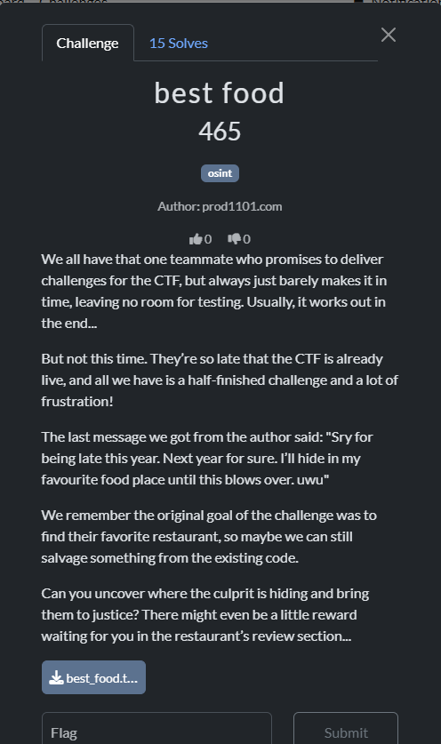
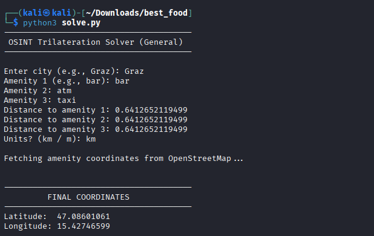
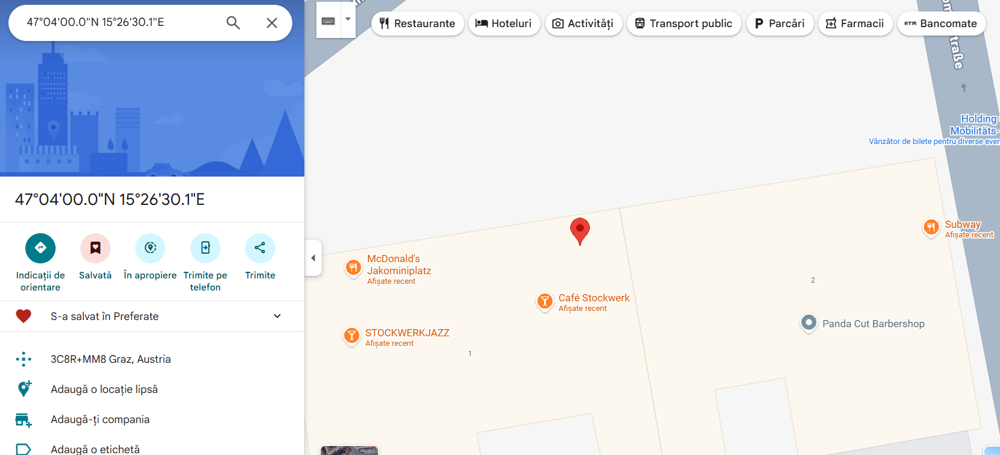
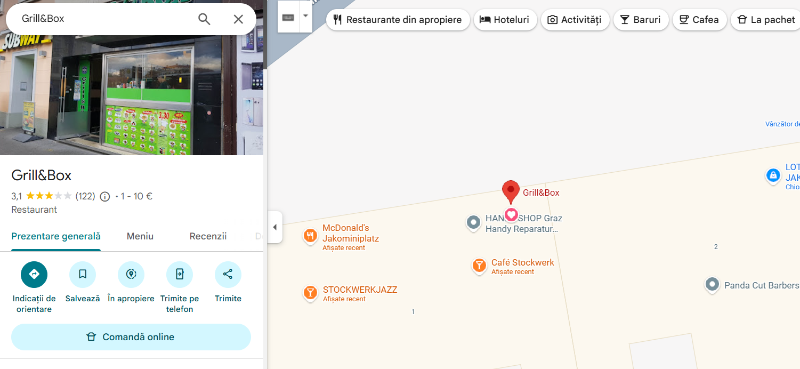
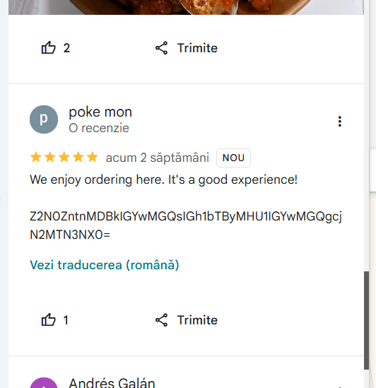

This challenge was my favourite by far it was to find the flag in the reviews of a restaurant that you have to find using a rust program they gave you.

First i used the rust file it was given to find out the center points of bars, ATMs, taxi stands, in a city (the CTF location → Graz), then triangulating a final location using distances.

I got 
bar_dist  = 0.6412652119499
atm_dist  = 0.2822972577454
taxi_dist = 0.9572772921063

The solve.py file when run will ask you info 

I got the final coordinates and went to google maps to find the restaurant 

Near it was this Grill&Box

In the reviews found this base64 txt

And converting it you find the flag