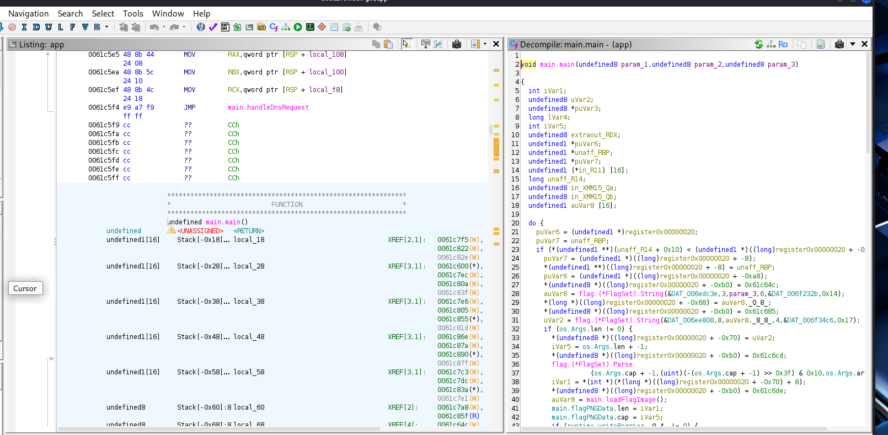

We were provided with a binary named app and a netcat connection string.
When running locally, it panicked: panic: open flag.png: no such file or directory. This confirmed the service reads a local flag image. We created a dummy flag.png to bypass this check and run the server locally.

Since the challenge provided a netcat (TCP) connection instead of a UDP port, we suspected DNS over TCP.

Testing with dig confirmed the server was listening but rejected standard queries:
dig +tcp @127.0.0.1 -p 53 google.com
# Output: status: NXDOMAIN

We analyzed the binary in Ghidra to find the "magic" domain.

After some ghidra analysis i created a solve.py